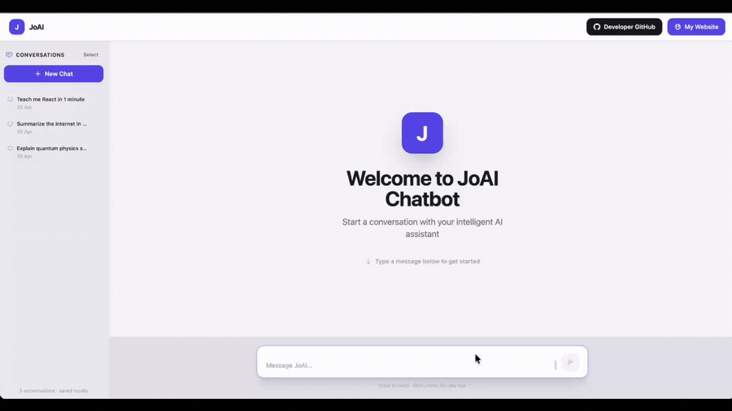

# JoAI Chatbot

> A personal AI chatbot built by João Vilas-Boas Correia — powered by Llama 3 LLM.

---

## Demo



---

## Overview

JoAI is a personal, production-ready AI chatbot built from scratch by João Vilas-Boas Correia. It features a clean, minimalist light-theme interface and connects to AI models via the OpenRouter API. Built with React + Vite on the frontend and Node.js + Express on the backend.

---

## Features

- Personal chatbot with a modern, clean interface
- User vs AI messages clearly separated (aligned left/right)
- Left sidebar with full conversation history (localStorage)
- Multi-select delete for chat history management
- Animated loading indicator while AI is thinking
- Auto-scroll to the latest message
- Input box fixed at the bottom with keyboard shortcuts
- Error handling for API failures (shown inline, non-blocking)
- Responsive design — works on mobile, tablet, and desktop
- Powered by OpenRouter API (supports any available model)
- Secure `.env`-based configuration — no hardcoded secrets
- Proxy via Vite dev server — no CORS issues during development

---

## Tech Stack

| Layer | Technology |
|---|---|
| Frontend | React 18 + Vite 5 |
| Styling | TailwindCSS 3 |
| Backend | Node.js + Express 4 |
| AI Integration | OpenRouter API |
| HTTP Client | Axios |
| Dev Tooling | Nodemon, Vite Dev Server |

---

## Project Structure

```
joai-chatbot/
├── assets/
│   ├── demo.gif                   # Demo preview
│   └── demo.mov                   # Original demo video
├── client/                        # React + Vite frontend
│   ├── src/
│   │   ├── components/
│   │   │   ├── Header.jsx         # Top bar with logo and nav buttons
│   │   │   ├── Sidebar.jsx        # Left conversation history panel
│   │   │   ├── WelcomeScreen.jsx  # Landing state before first message
│   │   │   ├── ChatWindow.jsx     # Scrollable message area
│   │   │   ├── MessageBubble.jsx  # Individual message bubble
│   │   │   ├── LoadingIndicator.jsx
│   │   │   └── InputBar.jsx       # Fixed bottom input form
│   │   ├── App.jsx                # Root component + state
│   │   ├── main.jsx               # React entry point
│   │   └── index.css              # Tailwind imports + custom animations
│   ├── index.html
│   ├── vite.config.js             # Dev proxy → localhost:3001
│   ├── tailwind.config.js
│   ├── postcss.config.js
│   └── package.json
├── server/                        # Express backend
│   ├── routes/
│   │   └── chat.js                # POST /api/chat
│   ├── services/
│   │   └── aiService.js           # OpenRouter API integration
│   ├── index.js                   # Server entry + CORS + routing
│   └── package.json
├── .env.example                   # Template — copy to .env
├── .gitignore
└── README.md
```

---

## Setup Instructions

### Prerequisites

- **Node.js 18+** — [nodejs.org](https://nodejs.org)
- **npm** (bundled with Node.js)
- **OpenRouter API key** — free at [openrouter.ai](https://openrouter.ai)

---

### Step 1 — Clone the repository

```bash
git clone https://github.com/jovbcorreia/joai-chatbot.git
cd joai-chatbot
```

### Step 2 — Configure environment variables

```bash
cp .env.example .env
```

Open `.env` and set your API key:

```env
OPENROUTER_API_KEY=sk-or-v1-xxxxxxxxxxxxxxxxxxxx
```

### Step 3 — Install backend dependencies

```bash
cd server
npm install
```

### Step 4 — Install frontend dependencies

```bash
cd ../client
npm install
```

---

## How to Run Locally

You need **two terminals** running simultaneously.

**Terminal 1 — Backend (Express server):**

```bash
cd joai-chatbot/server
npm run dev
# Server starts at http://localhost:3001
```

**Terminal 2 — Frontend (Vite dev server):**

```bash
cd joai-chatbot/client
npm run dev
# App available at http://localhost:5173
```

Open your browser at **http://localhost:5173** and start chatting.

---

## Environment Variables

All configuration lives in the `.env` file at the project root. Never commit this file.

| Variable | Required | Default | Description |
|---|---|---|---|
| `AI_PROVIDER` | No | `openrouter` | AI provider to use |
| `OPENROUTER_API_KEY` | Yes | — | Your OpenRouter API key |
| `OPENROUTER_MODEL` | No | `meta-llama/llama-3.3-70b-instruct:free` | Model to use — any free model from openrouter.ai |
| `PORT` | No | `3001` | Backend port |
| `CLIENT_URL` | No | `http://localhost:5173` | Frontend URL (CORS whitelist) |

---

## License

This project and its code belong to **João Vilas-Boas Correia** (joaopsn3@gmail.com).

All rights reserved © 2026
